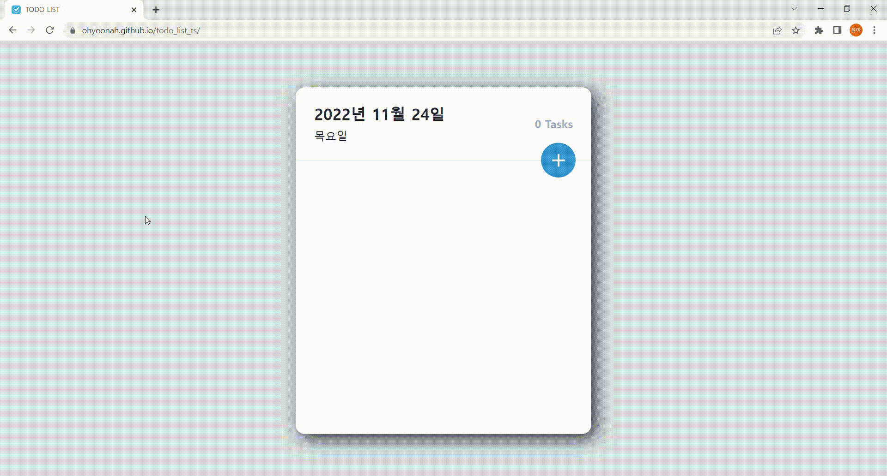

## Todo List

데이터의 삽입, 삭제, 수정, 저장이 가능한 일정 관리 애플리케이션 입니다.

기존 `Javascript`로 진행했던 프로젝트를 `Typescript`로 리팩토링 하였고, `Redux Toolkit` 라이브러리를 사용해 상태관리를 진행했습니다.

🔗 [블로그 기술 정리](https://ohyoonah.github.io/project/2022-11-23-todolist/)

🔗 [배포 사이트](https://ohyoonah.github.io/todo_list_ts/)

<br>



<br>

## 디렉토리 구조

```
├─ src
│  ├─ App.tsx
│  ├─ components
│  │  ├─ TodoEdit.tsx
│  │  ├─ TodoHead.tsx
│  │  ├─ TodoInsert.tsx
│  │  ├─ TodoItem.tsx
│  │  ├─ TodoList.tsx
│  │  └─ TodoTemplate.tsx
│  ├─ index.tsx
│  ├─ store
│  │  ├─ modules
│  │  │  └─ todoSlice.tsx
│  │  └─ index.tsx
│  └─ styles
│     ├─ colorPalette.ts
│     ├─ GlobalStyle.ts
│     ├─ todoEditStyle.ts
│     ├─ todoHeadStyle.ts
│     ├─ todoInsertStyle.ts
│     ├─ todoListStyle.ts
│     └─ todoTemplateStyle.ts
```

<br>

## 실행 방법

```
npm install --global yarn
yarn
yarn start
```

<br>

## 기술 스택


<br>

## 프로젝트 구조

#### src/components

- **`App.tsx`**: `GlobalStyle`과 `TodoTemplate` 컴포넌트를 보여줌
- **`TodoTemplate.tsx`**: 각 컴포넌트들을 포함하는 부모 컴포넌트
- **`TodoHead.tsx`**: 오늘의 날짜와 체크(완료)되지 않은 항목 개수 표시
- **`TodoInsert.tsx`**: 버튼 클릭 시 `input` 창이 노출되도록 구현
- **`TodoList.tsx`**: `TodoItem` 컴포넌트를 반복해 주는 부모 컴포넌트
- **`TodoItem.tsx`**: 입력한 항목과 체크(완료) 버튼, 수정 버튼, 삭제 버튼, 중요 표시 버튼 표시
- **`TodoEdit.tsx`**: 각 항목의 id 값을 받아와서 데이터를 수정할 수 있는 모달 생성

#### src/styles

- **`GlobalStyle.ts`**: 전역 스타일 적용
- **`colorPalette.ts`**: 사용되는 색상 정의

#### src/store

- **`index.tsx`**: `Redux Toolkit` store 및 로컬스토리지 관리
- **`todoSlice.tsx`**: `slice` 상태관리
